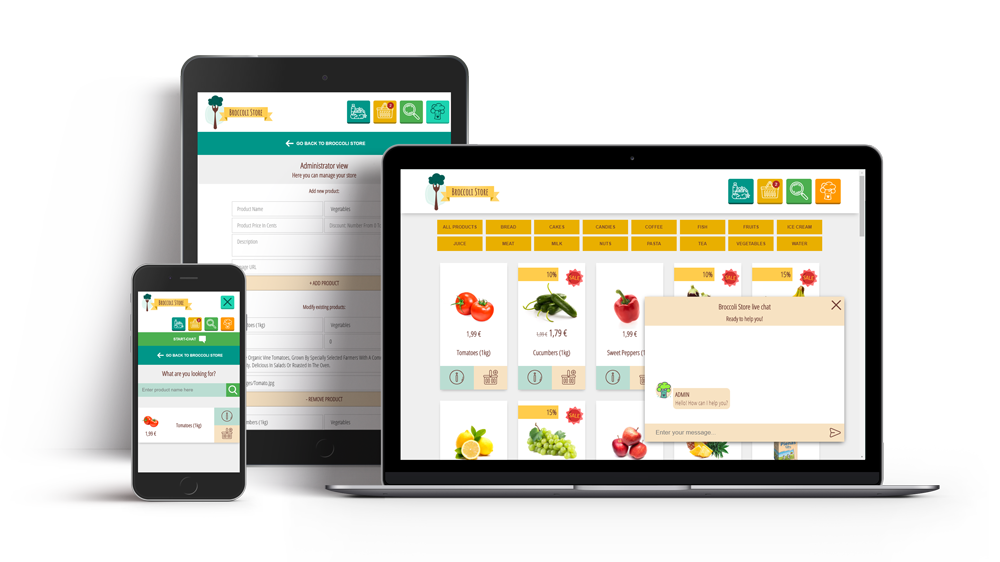

# Broccoli Store
## Project Overview
This is a grocery store concept, created using React. Only front-end functionality is covered in the project, no server is used. From client side it is possible to search products, filter products by category, add products to the cart. From administrator side it is possible to add, modify and remove products. Simple chat functionality is added. All functionality is open to play around.

## Project specifics
This project was bootstrapped with [Create React App](https://github.com/facebook/create-react-app).
Implemented features:
* Products can be filtered by category
* Search functionality
* Modal with additional product info
* Cart functionality: it is possible add and remove products from rhe cart
* Administrator view: products can be added, removed and modified
* Basic chat functionality: there are two roles client and administrator. There are three template messages that can be invoked with keywords: "hi", "payment" and "author"

## Acknowledgements
* Project created with [Create React App](https://github.com/facebook/create-react-app)
* Main page background picture by [Oleg Magni](https://www.pexels.com/photo/variety-of-fruits-890507/)
* Logo design by [Freepik](freepik.com)
* Icons design by [Flaticon](flaticon.com)
* CSS animations by [Justin Aguilar](http://www.justinaguilar.com/animations/#)
* Products images are from real store [barbora](https://www.barbora.lt/)

## Dependencies
* [react-router-dom](https://www.npmjs.com/package/react-router-dom) - renders different pages in the store: main page with animation and store page
* [prop-types](https://www.npmjs.com/package/prop-types)  - used to define types of props used in the application
* [enzyme](https://airbnb.io/enzyme/) - as an addition to testing tools, is used for shallow rendering
* Local Storage - is used to store some data right in the browser

## Project structure
The structure of the app:
```bash
├── README.md - This file.
├── package.json
├── public
│   ├── images #folder containing all images needed for the project
│   ├── logo-small.png
│   ├── logo-big.png
│   ├── manifest.json
│   └── index.html
└── src
    ├── components #main components for the app
    │   ├── styles #folder containing all the styles for the project
    │   │   ├── animations.css #css animations
    │   │   ├── App.css #main styles, including styles for the products gallery, cart, navigation, administrator view
    │   │   ├── mainpage.css #first page style
    │   │   ├── modal.css #modal style
    │   │   ├── notfound.css #not found page style
    │   │   ├── search.css #search style
    │   │   └── support.scss #support chat style
    │   ├── images #folder containing logos and background image for the main page
    │   ├── BroccoliStore.js #main component performing all the store functionality
    │   ├── MainPage.js #first page functionality
    │   ├── NotFound.js #component for all not existing pages
    │   ├── PopUpMessage.js #informative message functionality
    │   ├── StoreMenu.js #Navigation menu functionality
    │   ├── BackToStore.js #button component that redirects to the products gallery
    │   │   #Admin functionality
    │   ├── AdminView.js #component containing administrator functionality
    │   ├── AddProduct.js #component that adds a new product to the store
    │   ├── EditProduct.js #component responsible for products modification and removal functionality
    │   │   #Cart functionality
    │   ├── Cart.js #component containing cart functionality
    │   ├── Checkout.js #checkout pop up message component
    │   │   #Products display functionality
    │   ├── Categories.js #component containing products categories buttons, needed to filter products
    │   ├── Modal.js #component displaying additional info about product
    │   ├── Price.js #component displaying product price
    │   ├── Product.js #component displaying single product
    │   ├── ProductsGallery.js #component displaying all products
    │   ├── Search.js #component responsible for search functionality
    │   │   #Chat functionality
    │   ├── GroupChat.js #component responsible for chatting functionality
    │   └── Support.js #component loading chatting functionality
    ├── App.js #Routs pages
    ├── helper.js # Contains JavaScript helper functions
    ├── foodData.js # Contains products sample data
    ├── index.js # Used for DOM rendering only.
    │   #Testing features
    ├── setupTests.js #needed for enzyme setup
    └── __tests__ #folder containing test suites
```

## App preview
[Online demo](https://broccoli-store.netlify.com/)


## How to install
* Clone this repository

* In the project directory, run:

### `npm install`

* And then:

### `npm start`

Runs the app in the development mode.<br>
Open [http://localhost:3000](http://localhost:3000) to view it in the browser.
